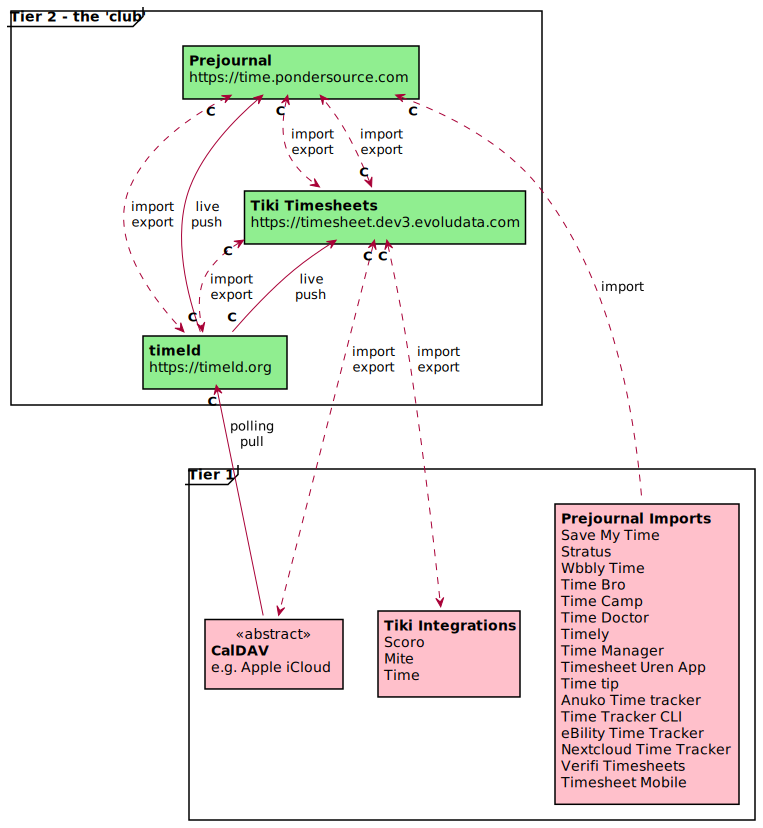

# timesheets
Federated Timesheets Project. Gitter: https://gitter.im/federatedbookkeeping/timesheets

This project has successfully created a Federated Timesheets network between three time tracking systems:

* [time.pondersource.com](https://time.pondersource.com) (an instance of [Prejournal](https://github.com/pondersource/prejournal/))
* [timesheet.dev4.evoludata.com](https://timesheet.dev4.evoludata.com/) (an instance of [WikiSuite](https://wikisuite.org/) with the [Tiki Timesheets Profile](https://profiles.tiki.org/Timesheets) enabled)
* [timeld.org](https://timeld.org/) (an instance of [Timeld](https://github.com/m-ld/timeld))

We call these three systems "the club". The rules for joining the club are:
* you have to be able to receive timesheets data from at least one existing club member
* you have to be able to send timesheets data to at least one existing club member
* you have to be able to forward timesheets data without causing duplication

We call the part of the network that is made up by club members "tier 2".
Other systems can also be linked to the network without becoming full club members. Such systems form "tier 1".
A tier 1 system may be able to send timesheets data to at least one club member, or receive timesheets data from at least one club member, or both.

NB: In the picture, **C** indicates a connector, and so marks the initiator of the connection. Where multiple systems are targeted, there is a separate connector for each.

Each human person entering timesheets data is considered to have one home system, which could be a tier 1 system or a tier 2 system. From there, this data will propagate to at least all tier 2 systems, and also to those tier 1 systems that are able to receive.

Currently, all tier 2 systems trust each other to only send data that originated from that person's home system, and not to add or change any of their timesheet entries.  [Milestone 6](https://github.com/federatedbookkeeping/timesheets#milestone-6-digital-signatures) will experiment with using digital signatures to improve this aspect.

See the [apps shortlist](./apps-list.md#shortlist) for a list of apps that are in Tier 1.

See the [data-formats/](./data-formats) folder for details about the various CSV, JSON, XML etc formats that are used to sync between Tier 2 and Tier 1 systems.
See the [API definitions wiki page](./wiki/API-Definitions-for-Federated-Time-tracking-tools) for formats that are used to sync between the three Tier 2 systems.
See the [data-formats/](./data-formats/) folder for details about the various CSV, JSON, XML etc formats that are used to sync between Tier 2 and Tier 1 systems.
See the [API definitions wiki page](https://github.com/federatedbookkeeping/timesheets/wiki/API-Definitions-for-Federated-Time-tracking-tools) for formats that are used to sync between the three Tier 2 systems.

# Management Summary

This project brings together developers from WikiSuite, m-ld.io, Muze and Ponder Source in a collaboration
to deliberately research how federated machine-readable data can work between independent software projects on the user-operated internet. We want to showcase how our vision of Federated Bookkeeping can make internet users "connected but sovereign".

Each project's timesheet system that tracks billable hours will be extended with time tracker apps (locally or on a self-hosted server) to expose machine-readable timesheet data through a query endpoint (reader pull) or through a webhook (writer push).

Furthermore, a W3C interest group "federated timesheets" has been started that will contain and maintain a repository of time tracker schemas and extend this continuously in an orderly fashion to enable developers to import recipients' schemas as well as add their own to the repository.

# Milestones List
We received a 50 kEUR grant from NGI Assure, which we will be claiming in small chunks along the following milestones.
The rough division of work (although this may change) is that [Ponder Source](https://pondersource.com) will work on milestones 1 and 4, [m-ld](https://m-ld.org) will be working on milestones 2 and 6, [EvoluData](https://evoludata.com/Open-Source-Software) will be working on milestone 3, and [Muze](https://www.muze.nl/) will be working on milestone 5.

The text of 1a, 2a, 3a is thrice the same.
The text of 1b, 2b, 3b is also thrice the same.

### Milestone 1: Prejournal
Prejournal.org will be a headless bookkeeping connector that can take data from many types of source documents and export data to many different bookkeeping tools. It can be run as a stand-alone LAMP application, or as a Nextcloud app.
* Deliverable: Tagged release of the code that does the following. 
* 1a - 6000 EUR) Import timesheets data from the timetracker tools listed in the wiki (4) that allow data retrieval, either through an API or through a manual export-and-import flow, as well as relevant open standards (like caldav etc).
* 1b - 6000 EUR) Export timesheets data to billable hours management tools listed in the wiki (4) that allow data entry, either through an API or through a manual export-and-import flow, as well as relevant open standards (like caldav etc).

### Milestone 2: m-ld
m-ld.io's time-tracking app - called ['timeld'](https://github.com/m-ld/timeld) - will use the m-ld live data software library both to persist data to the user's devices, and synchronise between them.
* Deliverable: Tagged release of the code that does the following:
* 2a - 6000 EUR) Import timesheets data from time-tracking tools listed in the wiki (4) that allow data retrieval, either through an API or through a manual export-and-import flow, as well as relevant open standards (like caldav etc.)
* 2b - 6000 EUR) Export timesheets data to billable hours management tools listed in the wiki (4) that allow data entry, either through an API or through a manual export-and-import flow, as well as relevant open standards (like caldav etc).

### Milestone 3: WikiSuite
Tiki Trackers are used extensively by EvoluData and its customers to track billable hours in the WikiSuite platform.
* Deliverable: Accepted code (not just a merge request) in the official version Tiki Wiki CMS Groupware (tiki.org LGPL) which does the following. 
* 3a - 6000 EUR) Import timesheets data from timetracker tools listed in the wiki (4) that allow data retrieval, either through an API or through a manual export-and-import flow, as well as relevant open standards (like caldav etc).
* 3b - 6000 EUR) Export timesheets data to billable hours management tools listed in the wiki (4) that allow data entry, either through an API or through a manual export-and-import flow, as well as relevant open standards (like caldav etc).

### Milestone 4: Documentation
* 6000 EUR) Formats wiki - a wiki that describes all the various formats and protocols, including a list of target formats for items 1), 2) and 3), with a simple repeating example. The target formats will be an agreed sub-list of all the formats found. Including hosting costs and other expenses.

### Milestone 5: Tooling
* 6000 EUR) Test suite and validation tools.

### Milestone 6: Digital Signatures
* 2000 EUR) Initial demo of how digital signatures can be used to sign timesheets by the worker, then timestamped by the server, then provenance verified by the final data recipient if digital signatures are found attached to the data received. This demo would not be production-ready, nor would it be implemented in all three systems from milestones 1), 2), and 3). It would mainly be meant as a first experiment, to document what would be needed in terms of public key discovery, possible implementation hurdles for digital signatures in various programming languages, and protocol design including data canonicalisation, to make all three systems aware of signatures in a possible second phase of this project.
